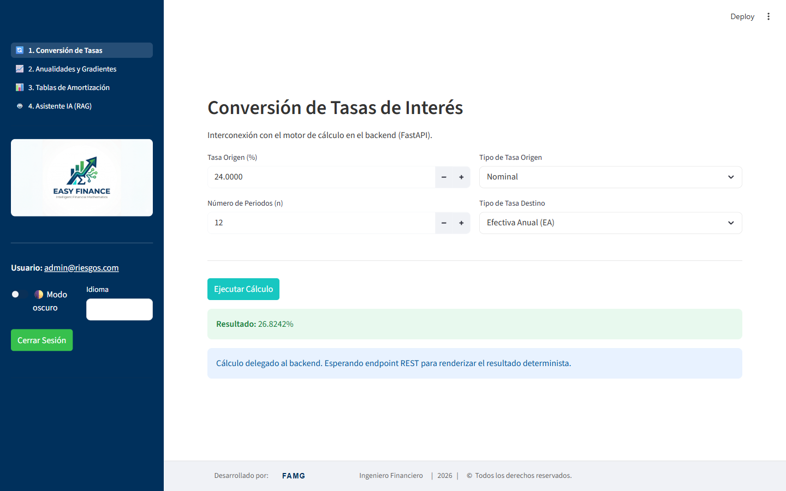
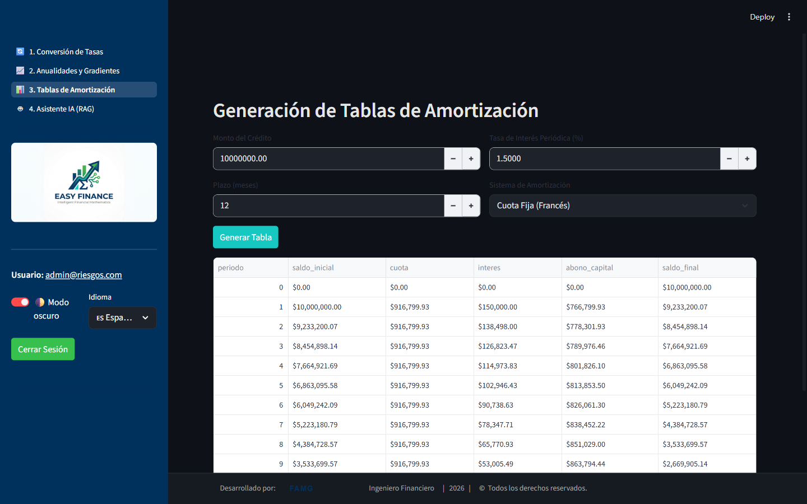
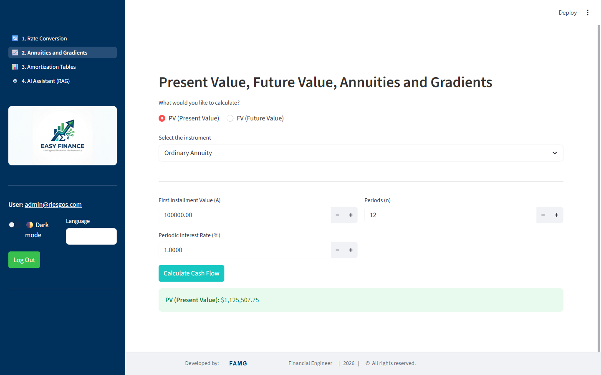
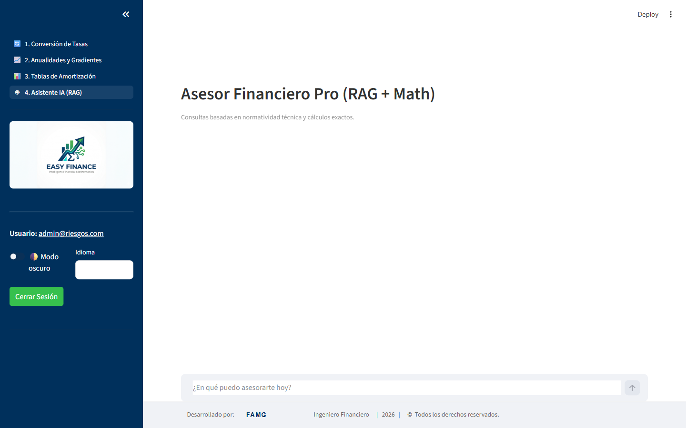

# 📈 Easy Finance

> **Deterministic financial calculation engine with AI-powered advisory (RAG + Agents)**

🌐 **[Leer en Español](README.es.md)**

Easy Finance is a full-stack application for students, advisors, and finance professionals. It combines an **exact calculation backend** (no AI hallucinations) with a **conversational assistant** that consults technical documentation and runs precise mathematical operations as callable tools.

The UI ships with a **dark/light theme switch** and an **English/Spanish language toggle**, both available from the login screen and the sidebar.

---

## 📸 Screenshots

| Rate Conversion (Light · Spanish) | Amortization Table (Dark · Spanish) |
|---|---|
|  |  |

| Annuities & Gradients (Light · English) | AI Assistant (Light · Spanish) |
|---|---|
|  |  |

---

## 🚀 Features

| Module | Description |
|--------|-------------|
| 🔄 **Rate Conversion** | Converts between Nominal, Periodic, and Effective Annual (EA) rates with exact formulas |
| 📈 **Annuities & Gradients** | Computes present/future value for ordinary and due annuities, plus arithmetic and geometric gradients |
| 📊 **Amortization Tables** | Generates full amortization schedules under the French (fixed installment) and German (fixed principal) systems |
| 🤖 **AI Assistant (RAG)** | Financial advisor that consults technical documentation (PDFs) and delegates exact math to deterministic tools |
| 🌓 **Dark / Light Mode** | Instant theme switch, persisted per session, applied consistently across every page |
| 🌐 **English / Spanish** | Full UI translation, including sidebar navigation, forms, and result messages |

---

## 🏗️ Architecture

```
Easy Finance/
├── backend/                    # REST API with FastAPI
│   ├── api/                    # Endpoints per module
│   │   ├── tasas.py
│   │   ├── amortizacion.py
│   │   ├── anualidades.py
│   │   └── chatbot.py          # AI agent endpoint
│   ├── core/                   # Deterministic financial logic (no AI)
│   │   ├── interest.py         # Rate conversion
│   │   ├── amortization.py     # Amortization tables
│   │   ├── annuities.py        # Annuities
│   │   ├── gradients.py        # Gradients
│   │   └── cashflows.py        # Cash flow orchestration
│   ├── schemas.py              # Pydantic models
│   └── main.py                 # FastAPI entry point
│
├── frontend/                   # Streamlit UI
│   ├── app.py                  # Main entry point, auth gate, theme/language toggles
│   ├── auth.py                 # Session authentication
│   ├── utils.py                # Helpers (CSS loading, theme sync, footer)
│   ├── i18n.py                 # Translation dictionaries and helpers
│   ├── assets/                 # Static assets (logo, CSS, screenshots)
│   └── modulos/                # Application pages
│       ├── 1_tasas.py
│       ├── 2_anualidades.py
│       ├── 3_amortizacion.py
│       └── 4_chatbot_rag.py
│
├── ai_engine/                  # AI engine
│   ├── agents/
│   │   ├── financial_agent.py  # LangChain agent with tools
│   │   └── math_agent.py       # Deterministic calculation tools
│   └── rag/
│       ├── ingest.py           # PDF indexing → ChromaDB
│       ├── retriever.py        # Semantic search
│       └── vectorstore/        # Vector database (local, gitignored)
│
├── data/
│   └── docs/                   # Regulatory/reference PDFs (gitignored)
│
├── Dockerfile
├── docker-compose.yml
├── render.yaml                 # Render deployment configuration
├── pyproject.toml
└── .env                        # Environment variables (gitignored)
```

---

## ⚙️ Tech Stack

- **Backend**: [FastAPI](https://fastapi.tiangolo.com/) + [Uvicorn](https://www.uvicorn.org/)
- **Frontend**: [Streamlit](https://streamlit.io/)
- **AI / LLM**: [Gemini](https://ai.google.dev/) via `langchain-google-genai`
- **Agent**: [LangChain](https://www.langchain.com/) — `AgentExecutor` with `StructuredTool`
- **RAG**: [ChromaDB](https://www.trychroma.com/) + `GoogleGenerativeAIEmbeddings`
- **Environment management**: [uv](https://github.com/astral-sh/uv)
- **Deployment**: Docker / [Render](https://render.com/)

---

## 📦 Local Setup

### Prerequisites
- Python 3.12+
- [`uv`](https://github.com/astral-sh/uv) installed
- A **Google API Key** (free at [Google AI Studio](https://aistudio.google.com/app/apikey))

### Steps

**1. Clone the repository and install dependencies:**
```bash
git clone <repository-url>
cd easy-finance
uv sync --link-mode=copy
```

**2. Configure environment variables:**
```bash
# Create the .env file at the project root
cp .env.example .env
```
Edit `.env` and add your key:
```env
GOOGLE_API_KEY=your_api_key_here
```

**3. (Optional) Index your PDF documents:**

Place PDF files in `data/docs/` and run:
```bash
uv run python ai_engine/rag/ingest.py
```
This processes the PDFs and builds the vector database in `ai_engine/rag/vectorstore/`.

---

## ▶️ Running the App

### Option A — Automatic script (Windows)
```powershell
.\run_app.ps1
```

### Option B — Manual (two terminals)

**Terminal 1 — Backend (FastAPI):**
```bash
uv run python -m uvicorn backend.main:app --reload
```
API available at: `http://127.0.0.1:8000`
Interactive docs: `http://127.0.0.1:8000/docs`

**Terminal 2 — Frontend (Streamlit):**
```bash
cd frontend
uv run python -m streamlit run app.py
```
App available at: `http://localhost:8501`

> Default demo credentials: `admin@riesgos.com` / `admin123` (mock auth in `frontend/auth.py`, meant to be replaced with real authentication before production use).

---

## 🐳 Docker Deployment

```bash
docker-compose up --build
```

---

## 🌐 Render Deployment

`render.yaml` defines two services (backend and frontend).

1. Connect your repository on [Render](https://render.com/).
2. Go to the backend service's **Environment** tab and add:
   - `GOOGLE_API_KEY` → your Google AI key.
3. Render will detect `render.yaml` and deploy both services automatically.

---

## 📐 Implemented Formulas

### Rate Conversion
| Conversion | Formula |
|---|---|
| Nominal → EA | `EA = (1 + i_nom/n)^n - 1` |
| Periodic → EA | `EA = (1 + i_per)^n - 1` |
| EA → Nominal | `i_nom = n * ((1 + EA)^(1/n) - 1)` |
| EA → Periodic | `i_per = (1 + EA)^(1/n) - 1` |

### Annuities & Gradients (Present Value)
| Instrument | Formula |
|---|---|
| Ordinary Annuity | `VP = A * (1 - (1+i)^-n) / i` |
| Annuity Due | `VP = A * (1 - (1+i)^-n) / i * (1+i)` |
| Arithmetic Gradient | `VP = VP_annuity + (G/i) * ((1-(1+i)^-n)/i - n/(1+i)^n)` |
| Geometric Gradient | `VP = A * (1 - ((1+j)/(1+i))^n) / (i - j)` |

Future value for any instrument is obtained as `VF = VP * (1+i)^n`.

### French Amortization
- Fixed installment: `A = P * i(1+i)^n / ((1+i)^n - 1)`

### German Amortization
- Fixed principal installment: `K = P / n`

---

## 🌓 Theme & 🌐 Language

- Theme and language preferences live in `st.session_state` and are re-applied on every page via `frontend/utils.py::load_css()`.
- Dark mode works by tagging the document root with `data-theme` and switching CSS custom properties defined in `frontend/assets/style.css`.
- Translations are centralized in `frontend/i18n.py`; UI labels use `t(key)` while selectable option values keep their internal (Spanish) identifiers so the backend contract never changes — only their displayed label is translated via `opt(category, value)`.

---

## 🔒 Security

- The `.env` file is excluded from the repository via `.gitignore`.
- The `data/` folder (PDFs) and `ai_engine/rag/vectorstore/` (database) are local-only and not pushed to the repository.
- The bundled login is a development mock — replace `frontend/auth.py` with real authentication before deploying publicly.

---

## 👤 Author

**Faiber Andres Montes Gómez**
Applied computational finance project powered by AI.

---

*Easy Finance — Exact calculations, intelligent advisory.*
